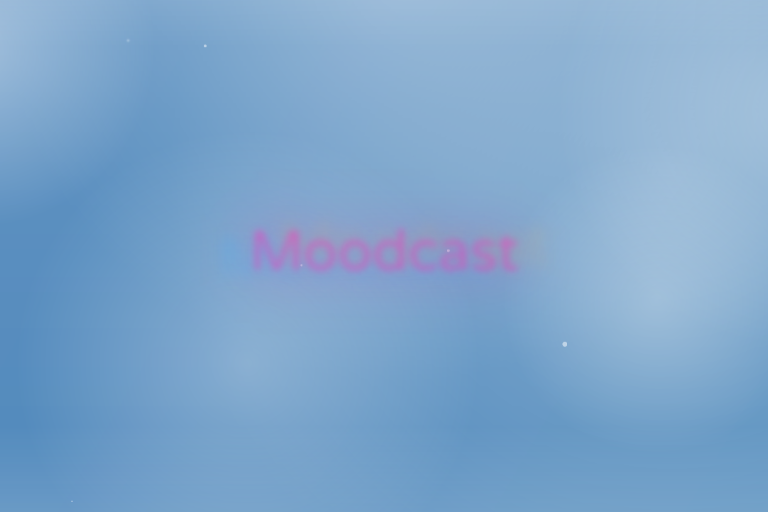

# Moodcast.us

The first vibes-based weather forecasting, unencumbered by pesky numbers and data. Visit now to perform a vibe check on your local weather, and see a meteorological synopsis condensed into colors and a single word.

## Features

- Automatic IP-based location detection
- Weather data fetching based on location
- Animations reflecting:
  - Temperature ranges (hot, warm, cool, cold)
  - Weather conditions (rain, snow, clouds, fog)
  - Humidity effects
  - Wind speed effects

## Technology Stack

- HTML5
- CSS3
- JavaScript (ES6+)
- Public APIs:
  - GeoJS - IP-based geolocation
  - OpenWeatherMap - weather data
  - Zippopotamus - zip code lookup

## Getting Started

1. Clone this repository
2. Replace `YOUR_OPENWEATHERMAP_API_KEY` in `js/app.js` with your actual [OpenWeatherMap API key](https://openweathermap.org/api)
3. Open `index.html` in a modern web browser

## Demo Mode

If no API key is provided or API calls fail, the application will use mock weather data to demonstrate the various visual effects.

## Visual Effects

### Temperature-based
- **Hot**: Orange/red oscillation
- **Warm**: Yellow/orange gradients
- **Cool**: Purple/dark blue tones
- **Cold**: Pale blue/white with frost effects

### Weather Conditions
- **Humid**: Condensation effect around screen edges
- **Clouds**: Translucent moving haze
- **Fog**: Static translucent haze
- **Wind**: Animated background speed changes
- **Snow**: Falling snowflake animation
- **Rain**: Falling raindrops animation
